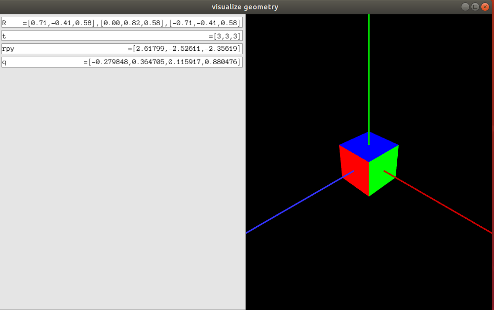
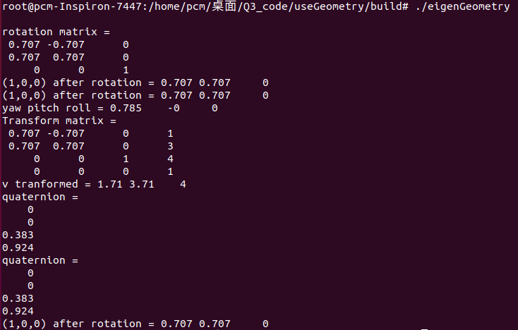

# 智能机器人第二次作业

#### 彭辰铭 SA18225293

## 1.首先在homework_1文件夹中我创建了include，src文件夹，其中各放入hello.h 与hello.cpp文件

## 2.编写CMakeLists.txt

### 编写主文件夹下的CMakeLists.txt


### 编写src文件夹下的CMakeLists.txt


## 3.编译、安装

### 创建build文件夹，并进入

外部编译的方式,输入

```cmd
cmake ..
make
make install
```

结果为

```cmd
-- The C compiler identification is GNU 7.3.0
-- The CXX compiler identification is GNU 7.3.0
-- Check for working C compiler: /usr/bin/cc
-- Check for working C compiler: /usr/bin/cc -- works
-- Detecting C compiler ABI info
-- Detecting C compiler ABI info - done
-- Detecting C compile features
-- Detecting C compile features - done
-- Check for working CXX compiler: /usr/bin/c++
-- Check for working CXX compiler: /usr/bin/c++ -- works
-- Detecting CXX compiler ABI info
-- Detecting CXX compiler ABI info - done
-- Detecting CXX compile features
-- Detecting CXX compile features - done
CMake Warning (dev) in CMakeLists.txt:
  No cmake_minimum_required command is present.  A line of code such as

    cmake_minimum_required(VERSION 3.10)

  should be added at the top of the file.  The version specified may be lower
  if you wish to support older CMake versions for this project.  For more
  information run "cmake --help-policy CMP0000".
This warning is for project developers.  Use -Wno-dev to suppress it.

-- Configuring done
-- Generating done
-- Build files have been written to: /home/pcm/桌面/homework_1/build

```

```cmd
Scanning dependencies of target hello_static
[ 25%] Building CXX object src/CMakeFiles/hello_static.dir/hello.o
[ 50%] Linking CXX static library libhello.a
[ 50%] Built target hello_static
Scanning dependencies of target hello
[ 75%] Building CXX object src/CMakeFiles/hello.dir/hello.o
[100%] Linking CXX shared library libhello.so
[100%] Built target hello

```

```cmd
[ 50%] Built target hello_static
[100%] Built target hello
Install the project...
-- Install configuration: ""
-- Installing: /usr/lib/libhello.so.1.2
-- Up-to-date: /usr/lib/libhello.so.1
-- Up-to-date: /usr/lib/libhello.so
-- Installing: /usr/lib/libhello.a
-- Installing: /usr/include/hello/hello.h

```

## 4.编译useHello.cpp文件并进行测试

创建一个useHello文件夹，其中创建src文件夹，并在其中放入useHello.cpp

主文件夹下编写CMakeLists.txt文件

```cmake
PROJECT(NEWHELLO)
ADD_SUBDIRECTORY(src)
```

src 文件夹下编写CMakeLists.txt文件

```cmake
ADD_EXECUTABLE(useHello useHello.cpp)
INCLUDE_DIRECTORIES(/usr/include/hello)
TARGET_LINK_LIBRARIES(useHello libhello.so)
```

(这里可以通过设置)

```cmd
export CMAKE_INCLUDE_PATH=/usr/include/hello
```

然后在CMakeLists.txt文件中将INCLUDE_DIRECTORIES替换为

```cmake
FIND_PATH(myHeader hello.h)
IF(myHeader)
INCLUDE_DIRECTORIES(${myHeader})
ENDIF(myHeader)
```

然后在主文件夹中创建build文件夹，并进入其中

使用

```cmd
cmake
make
cd src
./useHello
```

得到结果为


按照教程安装好Pangolin

运行结果为：



以及

